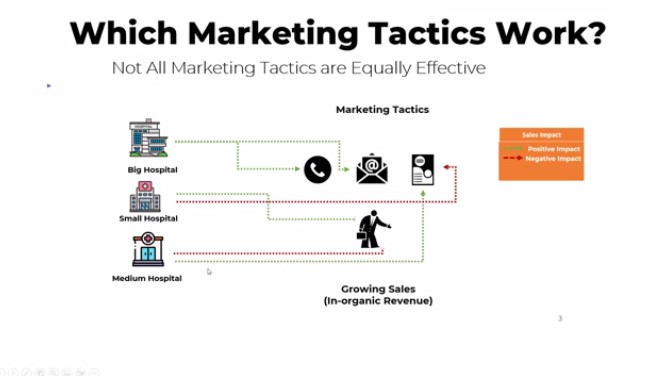

# Python Marketing Campaign Analytics

## Table of Contents
1. [Introduction](#introduction)
2. [Data Loading and Quality Assurance](#data-loading-and-quality-assurance)
3. [Feature Enhancement and Engineering](#feature-enhancement-and-engineering)
4. [Exploratory Data Analysis and Statistical Insights](#exploratory-data-analysis-and-statistical-insights)
5. [Conclusive Recommendations for Optimal Sales](#conclusive-recommendations-for-optimal-sales)

---

## Introduction

Welcome to the "Python Marketing Campaign Analytics" project, where we dive into optimizing marketing campaigns and building a data-driven strategy. This project harnesses the power of Python and machine learning techniques, specifically linear regression and correlation analysis, to uncover the most impactful marketing tactics influencing sales. The ultimate objective is to create a comprehensive ROI table for informed decision-making by management.

### Background of the Dataset

 

The dataset encompasses three types of hospital accounts: big, medium, and small hospitals. Sales data includes both organic and inorganic revenue generated through various marketing channels such as phone calls, emails, flyers, and sales visits.

Key questions to be addressed:
- What is the specific impact of each marketing strategy and sales visit on Sales (Amount Collected)?
- Does the effectiveness of each marketing strategy vary across different client types?

---

## Data Loading and Quality Assurance

This section focuses on the initial steps of loading the dataset and ensuring data quality. Rigorous quality assurance processes are applied to handle missing values, outliers, and other anomalies for reliable analysis.

---

## Feature Enhancement and Engineering

A robust marketing strategy requires meticulous feature engineering. This section explores the process of augmenting and refining features to optimize the performance of machine learning models. Effective feature engineering is pivotal for the development of a powerful linear regression model.

---

## Exploratory Data Analysis and Statistical Insights

Moving forward, the project delves into exploratory data analysis (EDA) and statistical analysis to extract insights into the impact of each marketing strategy on sales. The aim is to discern variations across different client types and pinpoint the most influential factors affecting sales.

---

## Conclusive Recommendations for Optimal Sales

The project concludes with the development of a comprehensive linear regression model and the identification of significant variables. The final recommendations section provides actionable insights, offering guidance on optimizing marketing strategies for achieving optimal sales across various hospital account types.

Feel free to explore, adapt, and implement the knowledge gained from this project to enhance your own marketing campaigns. The generated ROI table serves as a valuable resource for presenting strategic insights to management.

Happy optimizing!
